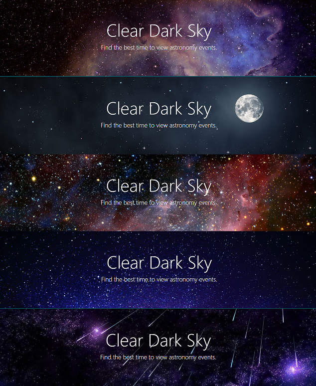

# Clear Dark Sky

## Description
The user can see whether or not they will have good stargazing viewing conditions based on their location, weather, and the state of the moon.

This project was completed by an entirely remote team due to the COVID-19 situation.  Team members met virtually using Zoom Meetings to discuss the project and work on code together.

## Goal 
### Using the following APIs:
| Name of API           |Data From API:                              |
|-----------------------|:------------------------------------------:|
| IPGeolocation         | User's Location by Latitude and Longitude  |
| WorldWeatherOnline    | Moon Data and Weather                      |

We will cross-reference the user's location with the state of the moon and cloud coverage for the user's location and determine whether or not the conditions are right for stargazing.

## How it Works
In order to determine viewing conditions, we needed to decide on what factors we would take into account.  To keep things simple, we determined the following two factors should be considered:
* Moon Illumination - needed because light reflecting off the moon will drown out stars
* Cloud cover - needed to determine how much of the night sky was visible

Using if/else statements, we determine if the current moon illumination and cloud coverage fall into either "excellent", "good", or "bad" viewing conditions.  This result is returned to the user on the website along with an image of the sky that matches their result.

## Design Elements
Clear Dark Sky uses primarily Bootstrap and Flexbox styling.  The landing page consists of a "jumbotron", a navigation bar, and a main div that holds the results containers.  The jumbotron randomly generates one of five space images for the background.  

The background of the main div is initially an image of the earth.  Once the user generates their stargazing forecast, the background will change to match their result: a clear night sky (excellent), a partly cloudy night sky (good), or a cloudy sky with a full moon (bad).  

There is an About Us page that explains and links to the APIs used.  The user can also access the Team page to learn a little more about the team that built the site.  The Team page uses Bootstrap elements to display each team member in a card with their name and what type of work they performed on the project.

## Problems
### Getting Appropriate Moon Data:
* We realized the IPGeolocation API did not give us enough info to easily determine the moon's state/phase.  We need this info in order to determine if the moon is too bright for good stargazing conditions.

### Solution:
* We found a new API (WorldWeatherOnline) that gives us both weather and moon data, including the current moon phase and moon illumination percent.  We had previously been using Weatherbit.io's API to provide our weather data.

### Forecasting Weather :
* We realized by pulling current weather, it may not be an accurate representation if the user is checking during the day and the weather is different at night.

### Solution:
* The weather API returns forecasted data as well.  Initially, we were pulling the data under "current weather."  We changed our variables to pull the data from the hourly forecast instead for 9:00 PM to provide a more accurate representation of tonight's weather.

